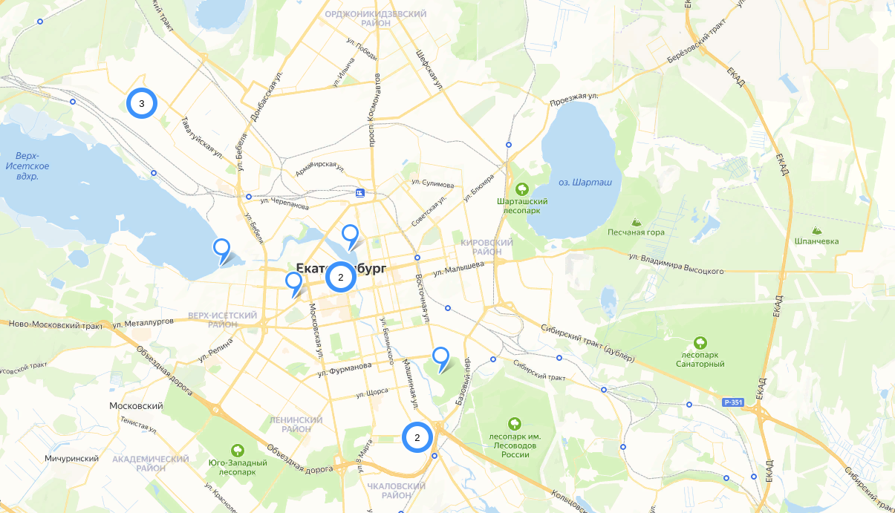
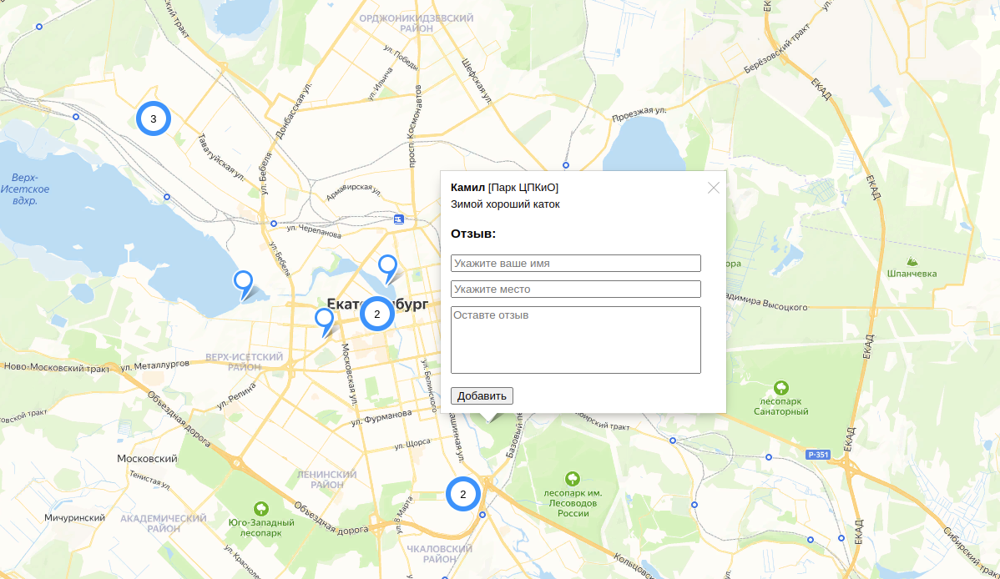
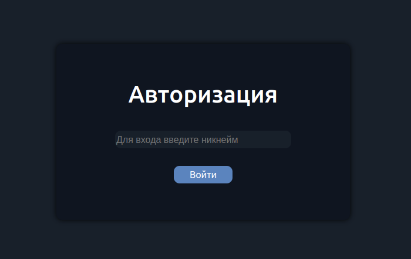
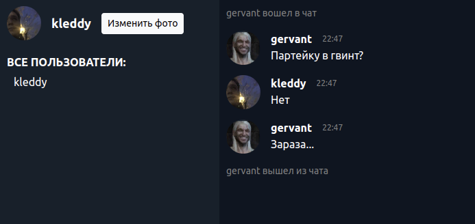
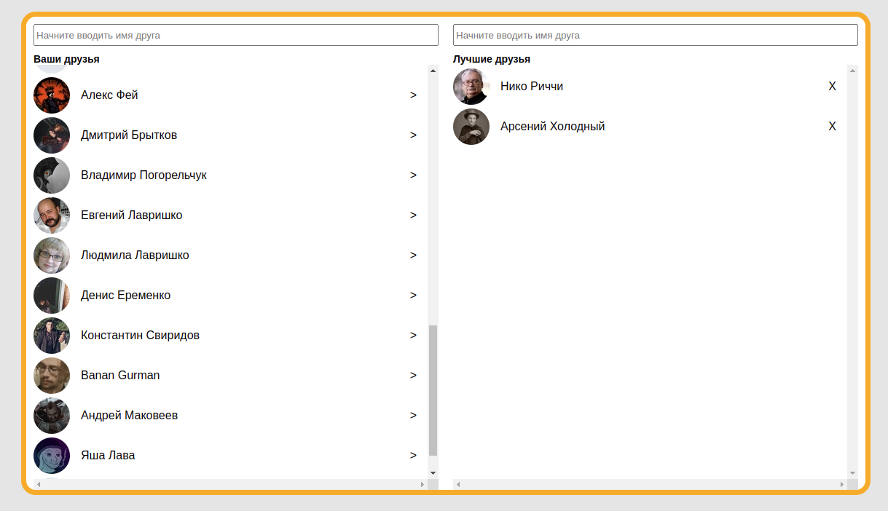

# Комплексное обучение JavaScript
Курс выполнен на универсальной сборке для домашних заданий от loftschool.com

<a href="https://loftschool.com/diploma/WA1652959323/en/pdf">EN-версия</a>

## Как запустить
- `npm install` - установить зависимости
- `npm run build` - собрать проект в папку build
- `npm run start` - собирает и запускает фронтенд на сервере

## Geo-Review - Выпускное задание №1
- `nodemon ./projects/geo-review/server/index.js` - запустить бэкенд на сервере 
- откройте проект на <a href="http://127.0.0.1:8080/geo-review"> `http://127.0.0.1:8080/geo-review` </a>

## Simple-Chat - Выпускное задание №2
- `nodemon ./projects/simple-chat/server/index.js` - запустить бэкенд на сервере 
- откройте проект на <a href="http://127.0.0.1:8080/simple-chat"> `http://127.0.0.1:8080/simple-chat` </a>

## VK-Friends - Выпускное задание №3
- указать vk appId на projects/vk-friends/friendsFilter.js:24
- откройте проект на <a href="http://127.0.0.1:8080/vk-friends"> `http://127.0.0.1:8080/vk-friends` </a>

